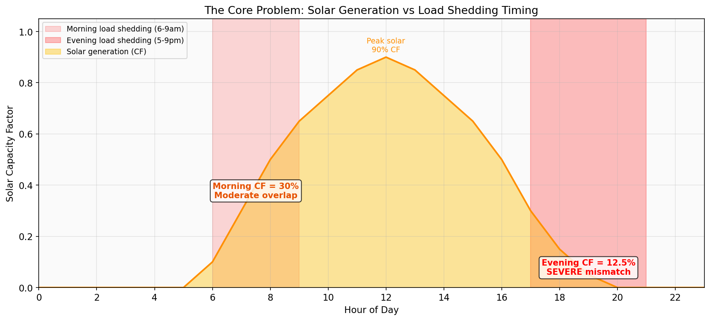
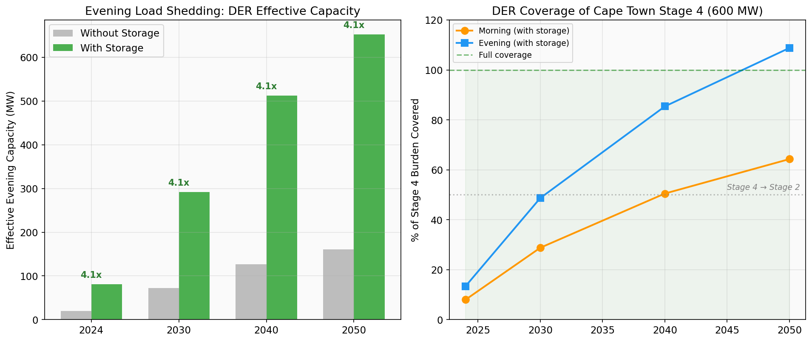
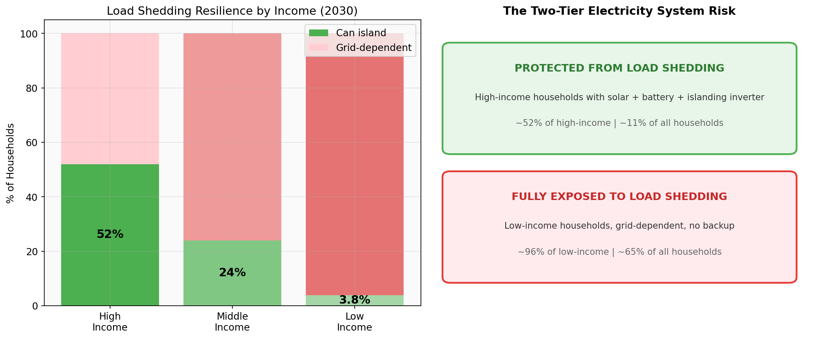
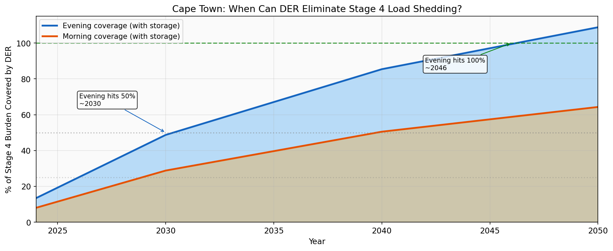

# Cape Town DER and Load Shedding: Executive Summary

## One-Line Finding

DER can meaningfully reduce load shedding in Cape Town, but only with battery storage, only during certain hours, and only for households that can afford islanding systems.

## The Core Problem

Solar generation peaks at midday (90% CF). Load shedding peaks in the evening (5-9pm, CF = 12.5%) and morning (6-9am, CF = 30%). Without storage, DER misses the window when households need it most.

## Storage Is a 4x Multiplier

Without storage, only 72 MW of DER is available during evening load shedding in 2030. With storage, that jumps to 292 MW. Storage turns a marginal contribution into a meaningful one.

## Key Numbers (2030, S3 Progressive Subsidy, with storage)

- **Total DER capacity**: 576 MW (residential + commercial)
- **Effective evening capacity**: 292 MW (51% of nameplate)
- **Stage 4 evening coverage**: 49% of Cape Town's 600 MW burden
- **Stage 4 morning coverage**: 29%
- **Households that can island**: 75,064 (10.8% of total)

## The Equity Problem

DER adoption and islanding capability are concentrated in high-income households. This creates a two-tier electricity system.

| Income Group | Can Island (%) | Grid-Dependent (%) |
|-------------|---------------|-------------------|
| High | 52% | 48% |
| Middle | 24% | 76% |
| Low | 3.8% | 96.2% |

As DER grows, high-income households exit load shedding while low-income households remain fully exposed. Without policy intervention, load shedding becomes an inequality amplifier.

## Timeline: When Does DER Eliminate Stage 4?

- **2030**: Evening coverage reaches 49%. Stage 4 effectively becomes Stage 2 for DER-equipped areas.
- **2040**: Evening coverage reaches 85%. Stage 4 is nearly eliminated for Cape Town.
- **2050**: Evening coverage exceeds 100%. Full Stage 4 mitigation achieved.

Morning coverage lags because storage provides less benefit when solar is already generating.

## Five Policy Priorities

1. **Subsidize battery storage alongside solar.** Without storage, DER provides only 25% of its potential load shedding relief.
2. **Target low-income storage access.** Community batteries and 80% subsidies can prevent the two-tier system.
3. **Mandate islanding inverters.** Many existing solar systems shut down during grid outages. Retrofit programs are needed.
4. **Consider midday load shedding.** Shifting load shedding to 11am-2pm (when solar CF is 75-90%) would let DER-rich areas avoid shedding entirely.
5. **Monitor revenue erosion.** High-income grid defection erodes the cross-subsidy base that keeps low-income tariffs affordable.
