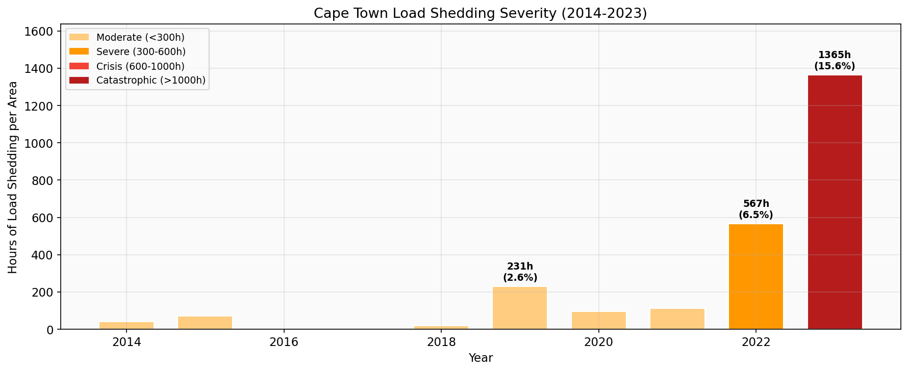
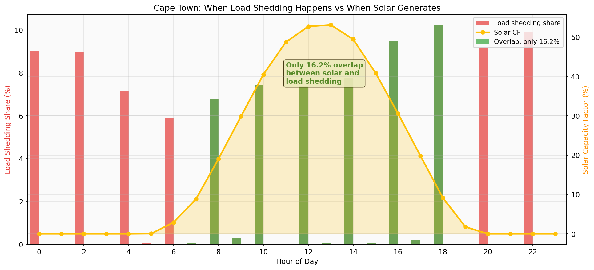
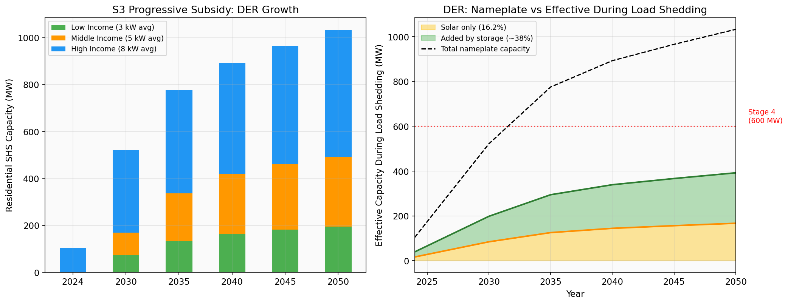
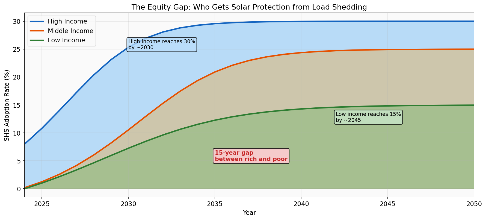

# Cape Town DER Potential to Mitigate Load Shedding
## Revised Analysis Based on Actual Data

---

## One-Line Finding

Solar DER without storage can only cover 16.2% of load shedding in Cape Town, because load shedding is distributed evenly across all 24 hours while solar generation is concentrated in a 6-8 hour midday window.

## The Crisis

Cape Town experienced catastrophic load shedding in 2022-2023. In 2023, each of the 16 load shedding areas averaged 1,365 hours of outages, meaning households were without power 15.6% of the year. This was a fivefold increase from 2018 (289 hours) and the worst on record.

## The Core Problem: Temporal Mismatch

The question is not how much DER capacity exists. The question is whether DER generates electricity during the hours when load shedding occurs. The answer is mostly no.

Cape Town's load shedding operates on a rotating 2-hour block schedule across 16 areas. Unlike peak-driven curtailment in other countries, this schedule distributes load shedding roughly evenly across all 24 hours. Night and evening together account for 47% of total load shedding minutes. Solar generation is zero during those hours.

The actual measured solar capacity factor from a Cape Town SHS system peaks at 53% around midday, far lower than the 85-90% commonly assumed for sunbelt locations. Cape Town sits at latitude -34 degrees with significant cloud cover, particularly in winter when load shedding is most severe.

When the hourly load shedding distribution is weighted by the hourly solar capacity factor, the effective overlap is 16.2%. This means that for every 100 minutes of load shedding, solar panels are generating useful power during only 16 of those minutes.

## What DER Can and Cannot Do

Under the S3 Progressive Subsidy scenario (Bass diffusion model), Cape Town's residential SHS capacity grows from 104 MW in 2024 to 522 MW in 2030 and 1,033 MW by 2050. These are significant numbers. But nameplate capacity is not the same as effective capacity during load shedding.

Without storage, the effective DER capacity during load shedding is only 16.2% of nameplate. A 522 MW fleet in 2030 delivers roughly 85 MW of effective load shedding relief. With battery storage (estimated 50% penetration, 5 kWh per system), effective coverage approximately doubles to 35-40% of nameplate, because batteries can store midday surplus for evening and nighttime discharge.

Even with storage, DER cannot fully replace grid supply during load shedding. At 2030 levels with storage, effective capacity reaches roughly 200 MW against a Stage 4 burden of 600 MW for Cape Town. Full Stage 4 coverage from DER alone would require either far more storage or a fundamental change in load shedding scheduling.

### Key Numbers

| Metric | 2024 | 2030 | 2040 | 2050 |
|--------|------|------|------|------|
| Households with SHS | 13,171 | 87,700 | 164,899 | 192,111 |
| Total SHS capacity (MW) | 104 | 522 | 893 | 1,033 |
| Annual generation (GWh) | 179 | 896 | 1,533 | 1,773 |
| Effective during LS, solar only (MW) | 17 | 85 | 145 | 167 |
| Effective during LS, with storage (MW) | 40 | 198 | 339 | 393 |
| Stage 4 coverage, solar only | 2.8% | 14.1% | 24.1% | 27.9% |
| Stage 4 coverage, with storage | 6.6% | 33.0% | 56.5% | 65.4% |

## The Equity Gap

DER adoption under the progressive subsidy follows income. High-income households reach 30% adoption by 2030. Low-income households do not reach 15% until 2045. This 15-year gap means that for the next two decades, load shedding protection from DER is overwhelmingly concentrated among the wealthy.

A high-income household with an 8 kW system and battery can ride through a 2.5-hour load shedding block. A low-income household without solar remains fully exposed to every outage. As DER adoption grows, the experience of load shedding becomes increasingly stratified by income. The same policy that reduces aggregate grid stress also widens the gap between who suffers from outages and who does not.

## Conclusions

1. **Solar alone is insufficient.** The 16.2% temporal overlap between solar generation and load shedding is a hard physical constraint. No amount of solar capacity changes this number. Only storage or schedule reform can improve it.

2. **Storage is the critical variable.** Battery storage roughly doubles the effective coverage from 16% to 35-40%. Any DER policy aimed at load shedding mitigation must include storage incentives, not just solar subsidies.

3. **Midday load shedding would transform the equation.** If Cape Town shifted some load shedding blocks to 10am-2pm (when solar CF is 40-53%), DER coverage would jump dramatically. This is a policy lever, not a technology constraint.

4. **The equity problem is real and growing.** Without targeted low-income storage programs (community batteries, 80%+ subsidies), DER adoption will make load shedding a poverty marker rather than a shared burden.

5. **DER is a complement, not a substitute.** Even under optimistic S3 assumptions with storage, DER covers at most 33% of Stage 4 by 2030. Grid-level solutions (new generation, imports, demand response) remain necessary for the other 67%.

## Data Sources

| Data | Source | File |
|------|--------|------|
| Load shedding hourly distribution | Cape Town Open Data Portal | LoadShedding_Summary_ByArea_Hourly_ALL.csv |
| Solar 15-min generation profile | Actual Cape Town SHS measurement | 15 Minute Data.csv |
| SHS adoption projections | Bass diffusion model (S3 scenario) | s3_bass_diffusion_results.csv |
| Household/building/block mapping methodology | Yoder et al. (2026) | github.com/biz-yoder/EnergyTransitionDuringEnergyCrisisCapeTown |
| Load shedding block geography | Cape Town Open Data Portal GeoJSON | Load_shedding_Blocks.geojson |
